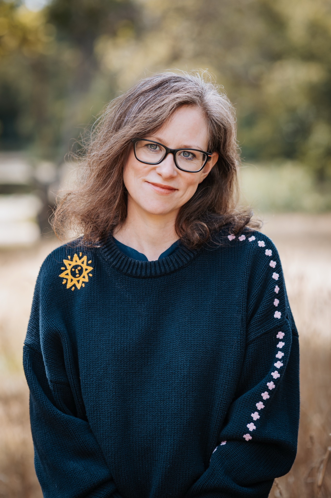
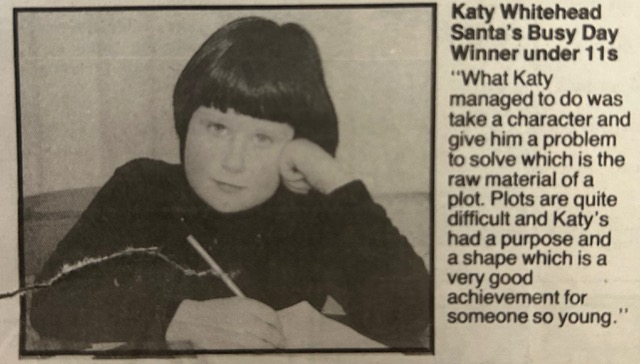
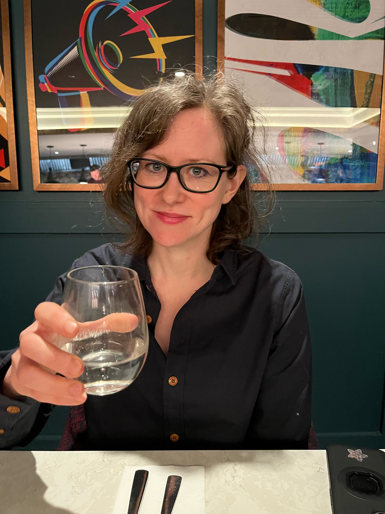
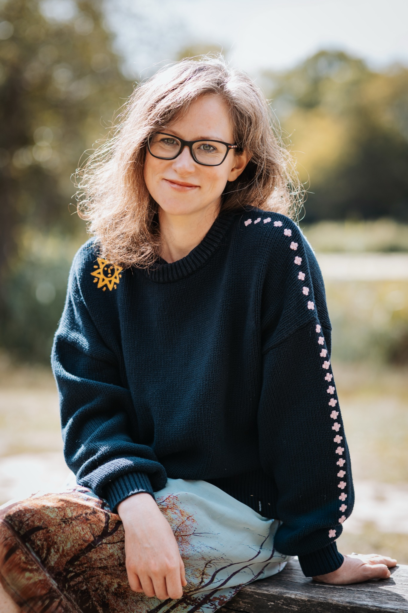

<section id="home">
    

        

            <h1 class="main-title">Katy Whitehead</h1>
            <h1>Writer and Editor</h1>
            
<a href="#writing">Writing</a>

            
<a href="#editing">Editing</a>

            
<a href="#read">Read My Work</a>

            
<a href="#contact">Contact</a>

        

        

            
        

    

</section>

<section id="banner">
    
    
Crafting stories since the nineties

</section>

<section id="writing">
    

        

            <h1>Writing</h1>
            
            
I'm the winner of the 2017 Fitzcarraldo Editions Essay Prize and the recipient of a 2021 Arts Council Developing Your Creative Practice grant.

            
            
I have been shortlisted or longlisted for the Bridport Short Story Prize, Myriad Editions First Drafts Prize, Penned in the Margin’s Generation Txt, Moniack Mhor Emerging Writers Award, Mslexia novel competition, London Magazine short story competition, L’Esprit Literary review competition and a Sky Academy Arts Scholarship.

            
I am an associate member of the Society of Authors, and a full member of Leather Lane Writers Group.

            
I have projects completed or nearly completed:

            
            
Wonderwood: a short feminist gothic novel about Brit, who leaves her groom on their wedding day and becomes a nanny for ethereal, sprite-like children at the country mansion that gives the book its name. After Brit encourages the children to break rules and play with time and responsibility, she finds herself caught up in their games when they use her tricks against her, and to their own ends. For fans of Carmen Maria Machado, Ottessa Moshfegh and Mariana Enriquez.

            
            
Fake Magick for Real Girls: a short story collection.

            
            
Time Only Goes One Way: this novel follows a dissatisfied mother-of-two who at nineteen started a globally beloved children’s book series, and who now, aged 39, returns to the woods where she found her original inspiration, seeking a new story. A metatextual story for fans of Katie Kitamura’s Audition, Lisa Halliday’s Asymmetry and Ian McEwan’s Atonement, it plays with children’s literature, fairytale, autofiction, nature writing and true crime, exploring – and subverting – the trauma plot.

            
            
I'm currently writing an autofictional novel about monogamy.

            
<a href="#read">Read my published work here</a>

        

        

            
        

    

</section>

<section id="editing">
    

        

            <h1>Editing</h1>
            
I am passionate about helping writers develop their stories.

            
I was previously Commissioning Editor at 4th Estate, where I worked on a range of literary fiction and non-fiction, acquiring books by Lena Dunham, creator of HBO's <i>Girls</i>, and National Book Award longlistee T. Geronimo Johnson, among others.

            
In 2023, I helped launch the short fiction site, <a href="https://cosmorama.site/">Cosmorama</a>, as Editor in Chief.

            
Currently, I work as a reader for <a href="https://literaryconsultancy.co.uk/">The Literary Consultancy</a>, the UK's longest-established editorial consultancy, where I am also on the editorial committee.

            
I read widely across genres, and pride myself on meeting the writer wherever they are at.

            <blockquote>
                
Smart, insightful, and supportive, Katy Whitehead is a delight to work with. She is intelligent and enthusiastic, rigorous, and, most importantly, possesses an astounding capacity to entertain narrative possibilities that are not yet fully clear to the author.  I remain indebted to her for the patience and wisdom demonstrated while I was writing <i>Welcome to Braggsville</i>.  Her support and insight were instrumental during that novel’s most significant transitional phase.

                <cite>- T Geronimo Johnson, bestselling author</cite>
            </blockquote>
            

            <blockquote>
                
Katy Whitehead is a superb editor and reader. She brings a wealth of experience and knowledge from working as a commissioning editor for a major publisher, but, crucially, she is also an exceptionally talented and respected writer, meaning she reads and edits with great empathy, understanding every aspect of the creative process. If something isn’t working in your draft, you can trust Katy to tell you directly, to explain why, and to make deeply thoughtful suggestions that will strengthen your prose and story.

                
The rigorous editorial report that Katy delivered on my novel has given me the confidence to send the manuscript out after more than two years of rewriting and editing. I would not have reached this point without her support and inspiration. If you are serious about being taken seriously as a writer, you should work with Katy.

                <cite>- Alex Hopkins, writer and editor</cite>
            </blockquote>
            

            <blockquote>
                
[Katy’s] skills as a reader and editor are unmatched in anything I’ve experienced in writing and publishing, and her ability to communicate her thoughts, critiques, and ideas is second to none… She became an adviser and a confidant. Her knowledge of the industry is thorough and she is a wealth of information and inspiration. When it comes to editing, she has the skills and experience to help turn a good story into a great story. She elevates the material while ensuring it retains its soul and voice.

                <cite>- Ryan O’Connell, Cosmorama founder</cite>
            </blockquote>
        

        

            
        

    

</section>

<section id="read">
    

        

            <h1>Read My Work</h1>
            <ul>
                <li><a href="https://granta.com/kidzania/">Kidzania</a> on Granta</li>
                <li><a href="/a-quarter-tab-of-loss/">A Quarter Tab of Loss</a>, originally published on Roxane Gay's Substack, <a href="https://audacity.substack.com/p/a-quarter-tab-of-loss">The Audacity</a></li>
                <li>For Graywolf Press' Graywolf Lab <a href="https://graywolflab.org/2025/11/14/escaping-the-family/">I wrote about escape rooms</a></li>
                <li><a href="https://dirt.fyi/article/2026/05/agony-and-the-planet-grew-hotter">Agony / And the Planet Grew Hotter</a> on dirt.fyi</li>
            </ul>
            
To keep up to date about new writing please follow me on <a href="https://substack.com/@katynophone">Substack</a> or Instagram <a href="https://www.instagram.com/katywhiteheadwriter/">@katywhiteheadwriter</a>.

        

    

</section>

<section id="contact">
    

        

            <h1>Contact</h1>
            
If you would like to discuss my work, or yours, please get in touch at <a href="mailto:leversandpivots@hotmail.com">leversandpivots@hotmail.com</a>.

        

        

            
        

    

</section>
