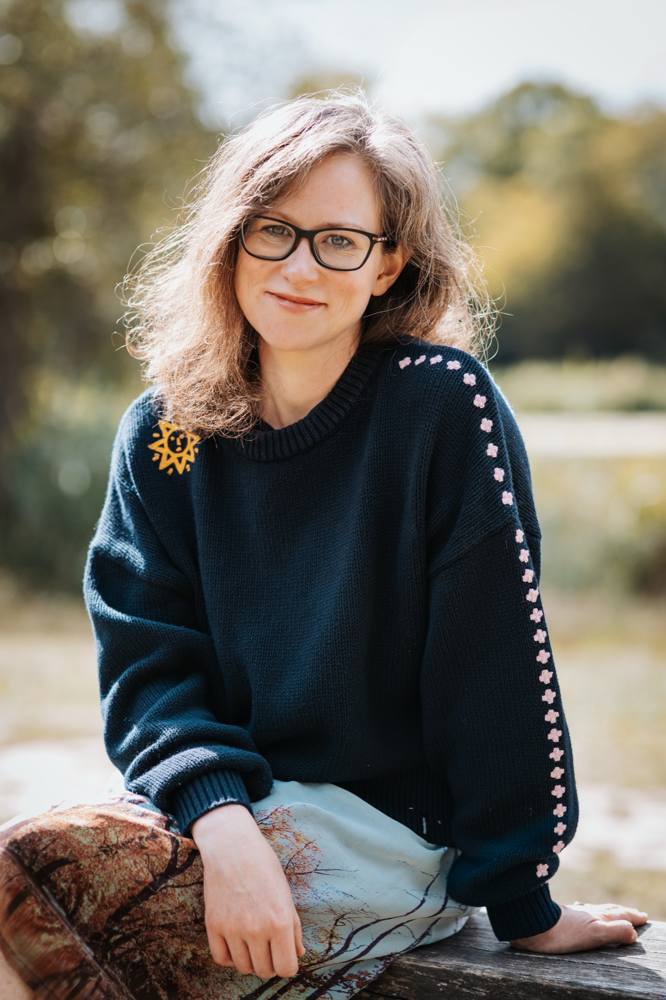

<section id="home">
    

        

            <h1 class="main-title">Katy Whitehead</h1>
            <h1>Writer and Editor</h1>
            
<a href="#writing">Writing</a>

            
<a href="#editing">Editing</a>

            
<a href="#read">Read My Work</a>

            
<a href="#contact">Contact</a>

        

        

            
        

    

</section>

<section id="banner">
    
    
Crafting stories since the nineties

</section>

<section id="writing">
    

        

            <h1>Writing</h1>
            
I'm the winner of the 2017 Fitzcarraldo Editions Essay Prize and the recipient of a 2021 Arts Council Developing Your Creative Practice grant.

        
            
I have been shortlisted for the Bridport Short Story Prize, the Myriad Editions First Drafts Prize, and Penned in the Margins Generation Txt.

            
I have been longlisted for the Moniack Mhor Emerging Writers Award, the Mslexia novel competition, and a Sky Academy Arts Scholarship.

        
            
I am an associate member of the Society of Authors, and a full member of Leather Lane Writers Group.

        
            
I work in both fiction and non-fiction.

            
I have a completed novella, <i>Wonderwood</i>, and a short story collection nearing completion.

            
My current project is a novel set in Epping Forest.

        

        

            
        

    

</section>

<section id="editing">
    

        

            <h1>Editing</h1>
            
I am passionate about helping writers develop their stories.

            
I was previously Commissioning Editor at 4th Estate, where I worked on a range of literary fiction and non-fiction, acquiring books by Lena Dunham, creator of HBO's <i>Girls</i>, and National Book Award longlistee T. Geronimo Johnson, among others.

            
In 2023, I helped launch the short fiction site, <a href="https://cosmorama.site/">Cosmorama</a>, as Editor in Chief.

            
Currently, I work as a reader for <a href="https://literaryconsultancy.co.uk/">The Literary Consultancy</a>, the UK's longest-established editorial consultancy, where I am also on the editorial committee.

            
I have a particular interest in innovative female voices, but read widely across genres, and pride myself on meeting the writer wherever they are at.

            <blockquote>
                
[Katy’s] skills as a reader and editor are unmatched in anything I’ve experienced in writing and publishing, and her ability to communicate her thoughts, critiques, and ideas is second to none… She became an adviser and a confidant. Her knowledge of the industry is thorough and she is a wealth of information and inspiration. When it comes to editing, she has the skills and experience to help turn a good story into a great story. She elevates the material while ensuring it retains its soul and voice.

                <cite>- Ryan O’Connell, Cosmorama Founder</cite>
            </blockquote>
        

        

            
        

    

</section>

<section id="read">
    

        

            <h1>Read My Work</h1>
            <ul>
                <li><a href="https://granta.com/kidzania/">Kidzania</a> on Granta</li>
                <li><a href="/a-quarter-tab-of-loss/">A Quarter Tab of Loss</a>, originally published on Roxane Gay's Substack, <a href="https://audacity.substack.com/p/a-quarter-tab-of-loss">The Audacity</a></li>
            </ul>
            
To keep up to date about new writing please follow me on <a href="https://substack.com/@katynophone">Substack</a>.

        

    

</section>

<section id="contact">
    

        

            <h1>Contact</h1>
            
If you would like to discuss my work, or yours, please get in touch at <a href="mailto:leversandpivots@hotmail.com">leversandpivots@hotmail.com</a>.

        

        

            
        

    

</section>